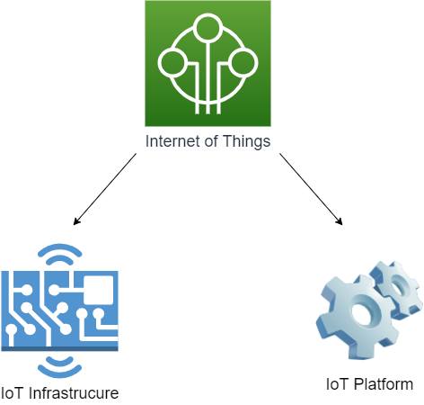
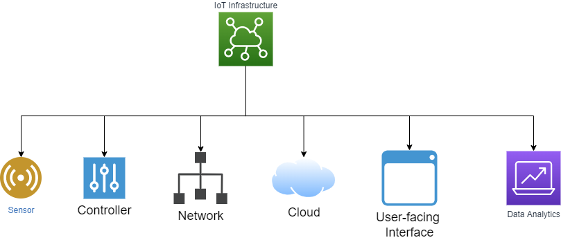

Tổng quan về IoT
================

Nội dung tổng quan về IoT được trình bày dựa trên tài liệu tham khảo trên Amazon [AmazonIoT]_ và Macrometa [MacrometaIoT]_.

Khái niệm IoT
-------------

:abbr:`IoT (Internet of Things)` là thuật ngữ mô tả tập hợp các network của các thiết bị được kết nối và công nghệ cung cấp giao tiếp giữa các thiết bị và cloud, cũng như giữa các thiết bị với nhau. Nhờ sự xuất hiện của các chip máy tính giá thành thấp và mạng viễn thông có băng thông tốc độ cao, chúng ta hiện nay có hàng tỷ thiết bị được kết nối với Internet. Điều này có nghĩa là các thiết bị hằng ngày như máy hút bụi, xe hơi, và các loại máy móc có thể sử dụng các cảm biến để thu thập dữ liệu và phản hồi một cách thông minh tới người dùng.

.. figure:: https://sudospaces.com/karofi-com/2022/06/internet-van-vat-iot.jpg
    :alt: Hình minh họa IoT.
    :align: center

    Hình minh họa IoT. Nguồn từ [Karofi]_.

Các thành phần quan trọng trong IoT
-----------------------------------

Trong IoT, hạ tầng và nền tảng IoT (minh họa như hình bên dưới) là hai thành phần quan trọng nhất. 

    Hình minh họa cơ bản về các thành phần trong IoT.

Trong đó, trong mức độ cơ bản, IoT đề cập đến bất kỳ hệ thống các thiết bị được kết nối mà có các cảm biến và khả năng xử lý nhúng (embedded). Lưu ý rằng các thiết bị không nhất thiết phải sử dụng Internet. Kể cả các thiết bị được kết nối cục bộ tương tác và trao đổi dữ liệu, là một hệ thống IoT [MacrometaIoT]_.

Về IoT platform, một IoT platform là một ứng dụng hoặc dịch vụ mà cung cấp các công cụ có sẵn và khả năng để kết nối vạn vật trong một hệ sinh thái IoT. Bằng cách cung cấp các chức năng bao gồm quan lý chu kỳ thiết bị, giao tiếp thiết bị, phân tích dữ liệu, tích hợp, và hỗ trợ ứng dụng [Softwareag]_.

Các thành phần trong hạ tầng IoT
--------------------------------

Trong hạ tầng IoT, hạ tầng IoT bao gồm 6 thành phần chính (theo tham khảo của Macrometa [MacrometaIoT]_ và minh họa như hình và bảng bên dưới). Đó là sensor, controller, network, cloud, user-facing applications, và data analytics.

    Hình minh họa cơ bản về các thành phần trong hạ tầng IoT.

+------------------------------+----------------------------------------------------------------------------------------------------------------------------------+
| Thành phần trong hạ tầng IoT | Mô tả                                                                                                                            |
+==============================+==================================================================================================================================+
| Sensor                       | Được sử dụng để đo lường các thông số vật lý mà thiết bị IoT chia sẻ thông qua mạng                                              |
+------------------------------+----------------------------------------------------------------------------------------------------------------------------------+
| Controller                   | Bộ não của thiết bị; hoạt động như một cầu nối giữa cảm biến và mạng và cũng thực hiện quá trình tính toán và lưu trữ trên board |
+------------------------------+----------------------------------------------------------------------------------------------------------------------------------+
| Network                      | Công nghệ được sủ dụng cho việc trao đổi dữ liệu với cả các thiết bị trong hệ thống hoặc cloud                                   |
+------------------------------+----------------------------------------------------------------------------------------------------------------------------------+
| Cloud                        | Các tài nguyên tính toán, lưu trữ, và gateway có thể truy cập thông qua Internet                                                 |
+------------------------------+----------------------------------------------------------------------------------------------------------------------------------+
| User-facing interface        | Các ứng dụng di động và web mà cho phép người dùng tương tác với hệ thống IoT và trực quan hóa dữ liệu                           |
+------------------------------+----------------------------------------------------------------------------------------------------------------------------------+
| Data Analytics               | Các công cụ và tài nguyên (thường trên cloud) mà cho phép người dùng hiểu rõ hơn về dữ liệu gửi lên hệ thống IoT                 |
+------------------------------+----------------------------------------------------------------------------------------------------------------------------------+

.. [AmazonIoT] What is IoT (Internet of Things)? - Everything you need to know - AWS. (n.d.). Amazon Web Services, Inc. https://aws.amazon.com/what-is/iot/
.. [MacrometaIoT] IoT Infrastructure Guide. (n.d.). Macrometa. https://www.macrometa.com/iot-infrastructure
.. [Karofi] Internet vạn vật (IoT) - Mạng lưới thiết bị kết nối Internet. (2022, November 6). Karofi. https://karofi.com/internet-van-vat-iot-mang-luoi-thiet-bi-ket-noi-internet-bv3037.html
.. [Softwareag] What is an IoT Platform? | IoT Platform Advantages & Capabilities. (n.d.). Software AG. https://www.softwareag.com/en_corporate/resources/iot/article/iot-platform.html