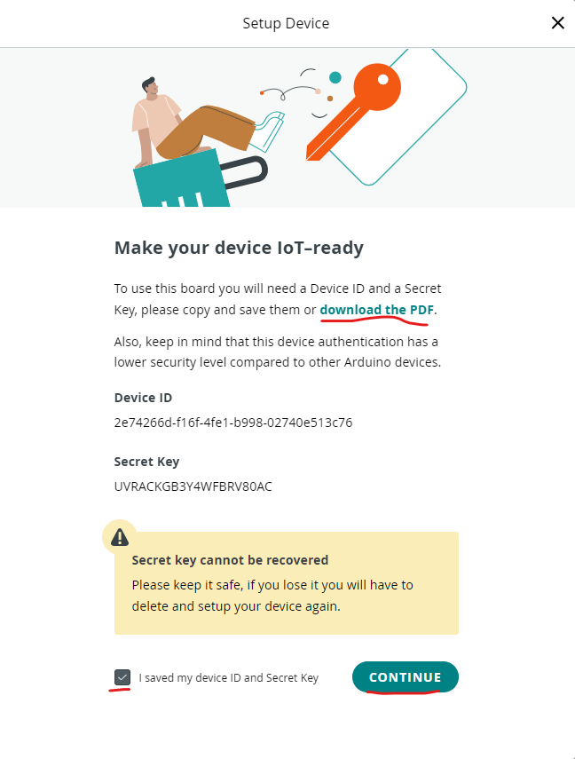

Thực hiện hệ thống
==================

Tổng quan
---------

Xây dựng hệ thống IoT giám sát nhiệt độ phòng. Trong đó, bo mạch sử dụng mạch `Arduino Uno R3 <UnoR3_>`_ và `Arduino ESP8266 Wifi Shield <AEWS_>`_. Thông số nhiệt độ phòng được đo từ cảm biến LM35_, được hiển thị trên giao diện web của Arduino Cloud (minh họa như hai hình bên dưới).


    Hình minh họa tổng quan về mạch IoT.


    Hình minh họa tổng quan về giao diện Web trên Arduino Cloud.

Lắp ráp phần cứng
-----------------

Các linh kiện cần chuẩn bị
``````````````````````````

6 loại linh kiện và bo mạch cần chuẩn bị (minh họa như hình bên dưới).

1. 1 mạch Arduino Uno R3.
2. 1 mạch Arduino ESP8266 Wifi Shield.
3. 1 breadboard.
4. 1 cảm biến LM35DZ
5. 8 dây đực-cái và 2 dây đực-đực.
6. 1 dây nạp USB.


    Hình minh họa các linh kiện phần cứng.

Sơ đồ mạch
``````````

1. Nối cảm biến trên breadboard
...............................


2. Kết nối breadboard với Arduino ESP8266 Wifi Shield
.....................................................

Nối dây 3.3V, GND, và chân Analog 3.3V từ Shield tới breadboard.


3. Kết nối Arduino ESP8266 Wifi Shield và Arduino Uno R3
........................................................


4. Kết dùng cáp USB nối mạch Arduino Uno R3 vào máy tính
........................................................


Kết nối Arduino Cloud
---------------------

Thiết lập cấu hình cloud
````````````````````````

1. Mở Arduino Create Agent

Khi Arduino Create Agent được bật, icon của Arduino Create Agent sẽ hiển thị dưới khay icon của Windows.


2. Truy cập vào trang chủ của `Arduino Cloud <https://cloud.arduino.cc/home/>`_.

Mở trang Arduino IoT Cloud.


3. Tạo mới một thing

.. figure:: ./pics/Screenshot_create_thing.png
    :alt: Create thing.
    :align: center

Sau đó, đặt tên cho thing và tạo device.


4. Tạo mới một device

.. figure:: ./pics/Screenshot-setup-new-device.png
    :alt: Create device.
    :align: center

Chọn **Third party device**.


Lựa chọn thiết bị **ESP8266** và board **NodeMCU 0.9 (ESP-12 Module)**. Sau đó chọn **CONTINUE**.


Đặt tên cho device và chọn **NEXT**.


Lưu các thông tin của device, chọn xác nhận đã lưu thông tin device, và chọn **CONTINUE**.



5. Cấu hình network

Chọn vào ô cấu hình **network**.

.. figure:: ./pics/Screenshot-network-config.png
    :align: center

Điền thông tin **Wi-Fi SSID**, **Wi-Fi PASWORD**, và **Secret key** trong **file PDF lưu thông tin device**. Sau đó chọn **Save**.

.. figure:: ./pics/Screenshot-network-save.png
    :align: center

6. Tạo Variable.

.. figure:: ./pics/Screenshot-create-variable.png
    :align: center
    
Đặt tên (**Name**), chọn kiểu dữ liệu (**Floating Point Number**), cấu hình **Variable Permission**, và chọn **ADD VARIABLE**.


Chuyển qua tab **SKETCH** và mở **full editor**.


6. Lập trình firmware của bo mạch.

Cấu hình loại **board** và **com port**.


Chọn loại board và port, và chọn **OK**.


Thêm các dòng code đo nhiệt độ.

.. code-block:: diff

    /* 
    Sketch generated by the Arduino IoT Cloud Thing "Untitled"
    https://create.arduino.cc/cloud/things/2abe9f1e-53be-444a-98c4-066f070ac92e 

    Arduino IoT Cloud Variables description

    The following variables are automatically generated and updated when changes are made to the Thing

    float temperature;

    Variables which are marked as READ/WRITE in the Cloud Thing will also have functions
    which are called when their values are changed from the Dashboard.
    These functions are generated with the Thing and added at the end of this sketch.
    */

    #include "thingProperties.h"
    + int sensorPin = A0;
    void setup() {
    // Initialize serial and wait for port to open:
    Serial.begin(9600);
    // This delay gives the chance to wait for a Serial Monitor without blocking if none is found
    delay(1500); 

    // Defined in thingProperties.h
    initProperties();

    // Connect to Arduino IoT Cloud
    ArduinoCloud.begin(ArduinoIoTPreferredConnection);
    
    /*
        The following function allows you to obtain more information
        related to the state of network and IoT Cloud connection and errors
        the higher number the more granular information you’ll get.
        The default is 0 (only errors).
        Maximum is 4
    */
    setDebugMessageLevel(2);
    ArduinoCloud.printDebugInfo();
    }

    void loop() {
    ArduinoCloud.update();
    // Your code here 
    + int reading = analogRead(sensorPin); 
    + float voltage = reading * 3.3 / 1024.0; 
    + temperature = voltage * 100.0;
     
    + Serial.println(temperature);
    + delay(1000);
    
    }

Nạp code vào board


Thông báo quá trình upload thành công


Chọn chế độ **Monitor** và theo dõi các giá trị nhiệt độ đo được.


7. Tạo Dashboard

Vào IoT Cloud, chọn tab **Dashboards**, và chọn **BUILD DASHBOARD**.

.. figure:: ./pics/Screenshot-dashboard-create.png
    :align: center

Đặt tên cho Dashboard, và tạo widget **Value**.


Đặt tên cho widget và chọn **Linked Variable**.


Liên kết widget với **Temperature** Variable. Sau đó, chọn **Done**.


Quan sát dữ liệu nhiệt độ real-time trên dashboard đã tạo.


.. _UnoR3: https://docs.arduino.cc/hardware/uno-rev3
.. _AEWS: https://nshopvn.com/product/arduino-esp8266-wifi-shield/
.. _LM35: https://www.ti.com/product/LM35?utm_source=google&utm_medium=cpc&utm_campaign=asc-sens-null-44700045336317707_prodfolderdynamic-cpc-pf-google-soas_int&utm_content=prodfolddynamic&ds_k=DYNAMIC+SEARCH+ADS&DCM=yes&gclid=CjwKCAjw6eWnBhAKEiwADpnw9ojoX6iAxUEk_AFZ_HcGg9V-IfEd6wjS7kg2NNrGZXOVoqw8k548TxoCYKQQAvD_BwE&gclsrc=aw.ds