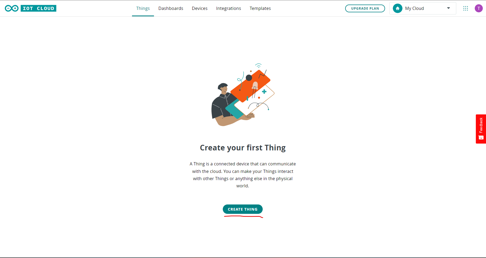
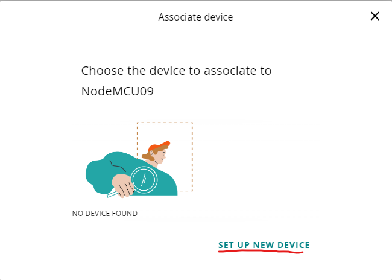
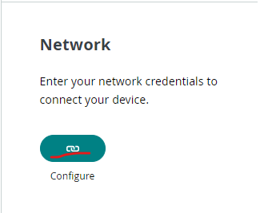
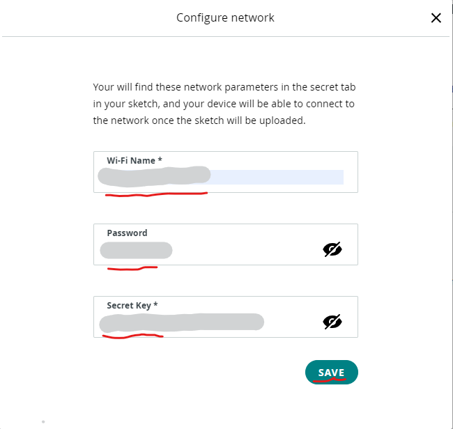
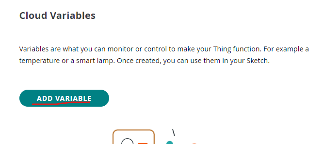
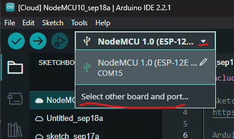
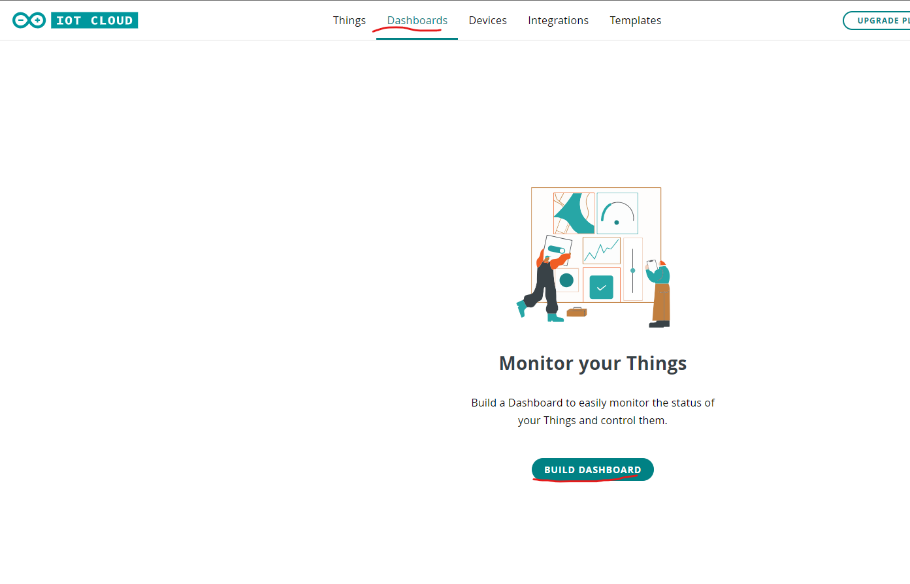

Thực hiện hệ thống
==================

Tổng quan
---------

Nội dung training hướng dẫn xây dựng hệ thống IoT giám sát nhiệt độ phòng. Cụ thể, hệ thống sử dụng cảm biến LM35_, `module NodeMCU V3 CH340 <NodeMCUV3_>`_, `Arduino Cloud <ACloud_>`_, và `Arduino IDE 2.x <AIDE2_>`_.


Thiết lập bo mạch
-----------------

1. Tổng quan về bo mạch
```````````````````````

Bo mạch được xây dựng trên các thành phần sau:
1. `Module NodeMCU V3 CH340 <NodeMCUV3_>`_.
2. Cảm biến LM35_.
3. Breadboard.
4. Cáp micro USB.
5. Dây dẫn đực-đực.


2. Kết nối bo mạch
``````````````````

Để kết nối bo mạch, tiến hành kết nối các thành phần theo các bước sau:

1. Kết nối module NodeMCU vào breadboard.
2. Kết nối cảm biến LM35 vào breadboard.
3. Kết nối chân nguồn và chân đất của cảm biến LM35.
4. Kết nối chân output của cảm biến LM35 vào chân **A0** của module ESP8266, cũng như chân nguồn vào chân **3V** và chân ground và chân **G**.
5. Kết nối cáp micro USB với module và máy tính.


Thiết lập Arduino Cloud
-----------------------

Mục đích của việc thiết lập là tạo dữ liệu cloud cho module ESP8266 trên Arduino Cloud.

Tạo Thing
`````````

1. Đăng nhập vào Arduino Cloud.
2. Vào trang `IoT Cloud <https://create.arduino.cc/iot>`_ của Arduino Cloud.

Sau đó, tạo dữ liệu của một thing.



3. Đặt tên cho thing và chọn Select device.


Tạo device và network
`````````````````````

1. Trong cửa số **Associate Device**, tạo dữ liệu của một device mới.



2. Trong cửa sổ **Setup Device**, chọn **Third party device**.

.. figure:: ./pics/Screenshot-third-party-select.png
    :align: center

Sau đó, chọn loại vi điều khiển **ESP8266** và board **NodeMCU 1.0 (ESP-12E Module)**.


Tiếp theo, đặt tên cho device.


Cuối cùng, lưu các thông tin của device, chọn xác nhận đã lưu thông tin device, và chọn **CONTINUE**.

.. figure:: ./pics/Screenshot-device-key.png
    :align: center

Tiếp theo, cấu hình network.

Đầu tiên, chọn button **Configure** trong phần network trong tab **Things** của IoT cloud.



Sau đó, điền thông tin **Wi-Fi Name**, **Password**, và **Secret Key**.



Tạo Variable
````````````

Trong dữ liệu của một thing, tạo mới dữ liệu của một **Variable**.



Sau đó, đặt tên (**Name**), chọn kiểu dữ liệu (**Floating Point Number**), cấu hình **Variable Permission**, và chọn **ADD VARIABLE**.

.. figure:: ./pics/Screenshot-config-variable-create.png
    :align: center

Thiết lập và lập trình trên ``Arduino IDE 2.x``
-----------------------------------------------

1. Tiến hành đồng bộ dữ liệu sketch với Arduino Cloud.
``````````````````````````````````````````````````````

Trong tab **SKETCHBOOK**, chọn tab **Cloud Sketchbook**.


Sau đó, tiến hành đồng bộ với cloud thông qua nút **Sync** (nút đánh dấu số 1) và pull dữ liệu sketch thông qua nút **Pull sketch** (nút được khoanh tròn như hình bên dưới).

.. figure:: ./pics/Screenshot-aide2-sketchbook-pull-sketch.png
    :align: center

2. Thiết lập board và port.
```````````````````````````

1. Trong của sổ của IDE, chọn phần lựa chọn board và chọn **Select other board and port...**.



2. Sau đó, chọn board **NodeMCU 1.0 (ESP-12E Module)** và port kết nối tương ứng.


3. Thêm các đoạn code tính nhiệt độ.

.. code-block:: diff

    /* 
    Sketch generated by the Arduino IoT Cloud Thing "Untitled"
    https://create.arduino.cc/cloud/things/2abe9f1e-53be-444a-98c4-066f070ac92e 

    Arduino IoT Cloud Variables description

    The following variables are automatically generated and updated when changes are made to the Thing

    float temperature;

    Variables which are marked as READ/WRITE in the Cloud Thing will also have functions
    which are called when their values are changed from the Dashboard.
    These functions are generated with the Thing and added at the end of this sketch.
    */

    #include "thingProperties.h"
    + int sensorPin = A0;
    void setup() {
    // Initialize serial and wait for port to open:
    Serial.begin(9600);
    // This delay gives the chance to wait for a Serial Monitor without blocking if none is found
    delay(1500); 

    // Defined in thingProperties.h
    initProperties();

    // Connect to Arduino IoT Cloud
    ArduinoCloud.begin(ArduinoIoTPreferredConnection);
    
    /*
        The following function allows you to obtain more information
        related to the state of network and IoT Cloud connection and errors
        the higher number the more granular information you’ll get.
        The default is 0 (only errors).
        Maximum is 4
    */
    setDebugMessageLevel(2);
    ArduinoCloud.printDebugInfo();
    }

    void loop() {
    ArduinoCloud.update();
    // Your code here 
    + int reading = analogRead(sensorPin); 
    + float voltage = reading * 3.3 / 1024.0; 
    + temperature = voltage * 100.0;
     
    + Serial.println(temperature);
    + delay(1000);
    
    }

4. Click nút **Upload**.

.. figure:: ./pics/Screenshot-aide2-click-upload-btn.png
    :align: center

    Upload button.


    
    Thông báo upload thành công.

5. Push dữ liệu sketch lên cloud.

Trên IDE, chọn nút **Push sketch**.


Quan sát kết quả trên IDE
`````````````````````````

Trên giao diện IDE, chọn nút **Serial Monitor** và quan sát giá trị nhiệt độ đo được trên board.


Quan sát kết quả trên IoT Dashboard
```````````````````````````````````

1. Tạo dữ liệu một Dashboard.

Trong giao diện web của **IoT Cloud**, chọn tab **Dashboards**, và tạo mới dữ liệu của một **Dashboard**.



2. Đặt tên cho dashboard và tạo **Value** widget.


3. Đặt tên cho widget và chọn **Link Variable**.

.. figure:: ./pics/Screenshot-widget-config.png
    :align: center

4. Liên kết với variable đã tạo và chọn **LINK VARIABLE**.


5. Quan sát giá trị nhiệt độ đo được trên dashboard.


.. _LM35: https://www.ti.com/product/LM35?utm_source=google&utm_medium=cpc&utm_campaign=asc-sens-null-44700045336317707_prodfolderdynamic-cpc-pf-google-soas_int&utm_content=prodfolddynamic&ds_k=DYNAMIC+SEARCH+ADS&DCM=yes&gclid=CjwKCAjw6eWnBhAKEiwADpnw9ojoX6iAxUEk_AFZ_HcGg9V-IfEd6wjS7kg2NNrGZXOVoqw8k548TxoCYKQQAvD_BwE&gclsrc=aw.ds
.. _NodeMCUV3: https://nshopvn.com/product/arduino-nodemcu-lua-wifi-v3/
.. _ACloud: https://cloud.arduino.cc/
.. _AIDE2: https://www.arduino.cc/en/software