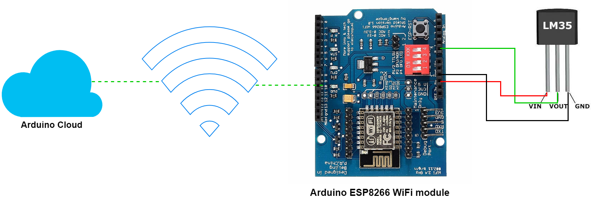

=========
Tổng quan
=========

Nội dung training IoT của PTN DESLab_ sẽ hướng dẫn xây dựng hệ thống IoT đơn giản giám sát nhiệt độ phòng.
Cụ thể, hệ thống IoT sử dụng cảm biến nhiệt độ LM35_, module `Arduino ESP8266 Wifi Shield <AEWS_>`_, và `Arduino Cloud <ACloud_>`_.

Về kiến thức
------------

.. note:: 
    
    Do thời gian rất có hạn, nếu các bạn chưa có nhiều kiến thức về lập trình C, các bạn chỉ cần đọc qua 6 tài liệu tham khảo được đề cập và **không cần tìm hiểu quá chi tiết**.

Để xây dựng một hệ thống IoT, các kiến thức cần tìm hiểu bao gồm:
    1. Kiến thức tổng quan về IoT [#IoT1]_ [#IoT2]_.
    2. Đọc hiểu datasheet của các thiết bị điện tử [#datasheet]_.
    3. Kiến thức lập trình C/C++ cơ bản [#C]_.
    4. Tổng quan về Arduino Framework [#ArduinoF]_.
    5. Kiến thức tổng quan về Arduino Cloud [#ACloudF]_.

Về môi trường làm việc
----------------------

Để xây dựng hệ thống IoT với Arduino Cloud, môi trường làm việc cần có những thiết lập sau:
    1. Máy tính cá nhân Windows/Linux/MacOS.
    2. `Tài khoản đăng ký trên Arduino Cloud <ACloudLogin_>`_.
    3. Phần mềm `Arduino Create Agent <ACA_>`_.

Về hệ thống IoT trong nội dung training
---------------------------------------

Hệ thống IoT trong nội dung training là hệ thống IoT giám sát nhiệt độ phòng. Trong hệ thống này:

1. Cảm biến LM35_ là ngoại vi giám sát nhiệt độ,
2. Vi điều khiển `ESP8266 <AEWS_>`_ là thiết bị tương tác với cảm biến và cloud.
3. `Arduino Cloud <ACloud_>`_ thu nhận và hiển thị dữ liệu thiết bị.

Trên phần cứng, vi điều khiển ESP8266 tương tác với cảm biến LM35 thông qua chân **A0** (như hình minh họa dưới đây).

    Tổng quan về sơ đồ mạch.

.. footnote
.. [#IoT1] `Các khái niệm tổng quan về IoT trên Amazon <AmazoneIoT_>`_.
.. [#IoT2] `Khái niệm cơ bản về IoT Infrastructure trên Macrometa <MacrometaIoT_>`_.
.. [#datasheet] Datasheet của cảm biến LM35_ trên TI.
.. [#C] `Khóa học lập trình C cơ bản trên Codelearn.io <CodelearnIOC_>`_.
.. [#ArduinoF] `Tổng quan về Arduino Framework <Arduino_>`_.
.. [#ACloudF] `Cơ bản về Arduino Cloud <ACloudDoc_>`_.
.. Link
.. _DESLab: https://deslab.vn
.. _LM35: https://www.ti.com/product/LM35?utm_source=google&utm_medium=cpc&utm_campaign=asc-sens-null-44700045336317707_prodfolderdynamic-cpc-pf-google-soas_int&utm_content=prodfolddynamic&ds_k=DYNAMIC+SEARCH+ADS&DCM=yes&gclid=CjwKCAjw6eWnBhAKEiwADpnw9ojoX6iAxUEk_AFZ_HcGg9V-IfEd6wjS7kg2NNrGZXOVoqw8k548TxoCYKQQAvD_BwE&gclsrc=aw.ds
.. _AEWS: https://nshopvn.com/product/arduino-esp8266-wifi-shield/
.. _AmazoneIoT: https://aws.amazon.com/what-is/iot/
.. _MacrometaIoT: https://www.macrometa.com/iot-infrastructure
.. _CodelearnIOC: https://codelearn.io/learning/c-for-beginners
.. _Arduino: https://docs.arduino.cc/learn/starting-guide/getting-started-arduino
.. _ACloud: https://cloud.arduino.cc/
.. _ACloudDoc: https://docs.arduino.cc/arduino-cloud/getting-started/iot-cloud-getting-started
.. _ACloudLogin: https://login.arduino.cc/login
.. _ACA: https://support.arduino.cc/hc/en-us/articles/360014869820-Install-the-Arduino-Create-Agent
.. _AIDE: https://www.arduino.cc/en/software