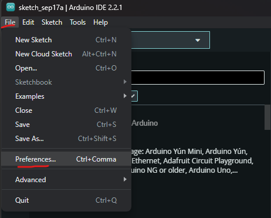
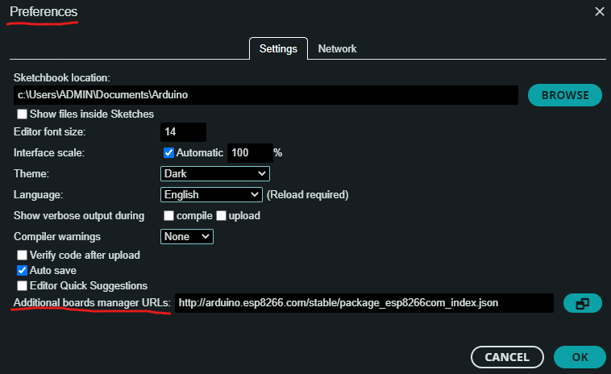
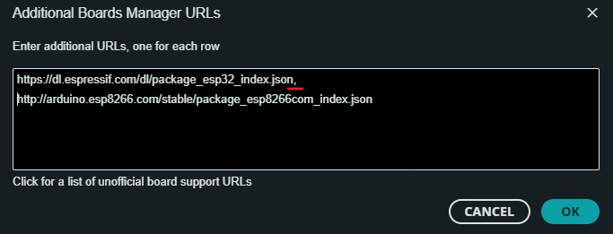
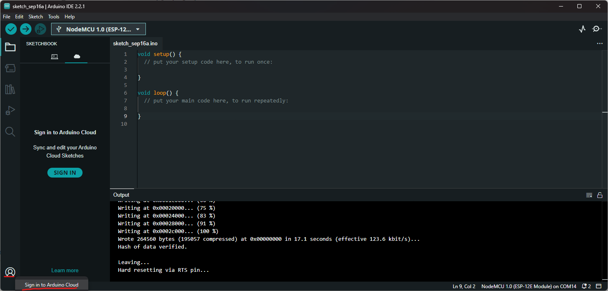
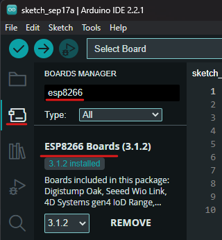
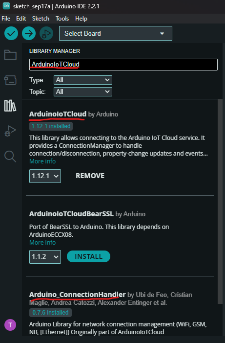

.. _phan-tong-quan:

Tổng quan
=========

Nội dung training hướng dẫn xây dựng hệ thống IoT giám sát nhiệt độ phòng sử dụng cảm biến LM35_, module `NodeMCU V3 CH340 <NodeMCUV3_>`_.

Môi trường làm việc
-------------------

Môi trường làm việc cần được thiết lập các thành phần sau đây:

1. Cảm biến LM35, module `NodeMCU V3 CH340 <NodeMCUV3_>`_, breadboard, và dẫn dẫn (được cung cấp khi tham gia training).
2. Máy tính Windows/Linux/MacOS.
3. Driver CH340_.
4. Phần mềm `Arduino IDE 2.x <AIDE2_>`_.
5. Tài khoản `Arduino Cloud <ACloudLogin_>`_.

Các thiết lập cần có trên Arduino IDE
-------------------------------------

1. Cài đặt **Additional Boards Manager URLs**.

.. include:: <isonum.txt>

Vào **File** |rarr| **Preferences...**. Sau đó, trong cửa sổ **Preferences**, thêm đường dẫn ``http://arduino.esp8266.com/stable/package_esp8266com_index.json`` vào mục **Additional boards manager URLs**.

.. note:: Nếu đã có URL trong mục này, thêm dấu phẩy "," và thêm URL trên, vào sau đó.

2. Đăng nhập tài khoản Arduino Cloud.

3. Cài đặt dữ liệu của vi điều khiển **ESP8266** trong phần **Boards Manager**.

4. Cài đặt thư viện **ArduinoIoTCloud** và **Arduino_ConnectionHandler** trong phần **Library Manager**.

.. _LM35: https://www.ti.com/product/LM35?utm_source=google&utm_medium=cpc&utm_campaign=asc-sens-null-44700045336317707_prodfolderdynamic-cpc-pf-google-soas_int&utm_content=prodfolddynamic&ds_k=DYNAMIC+SEARCH+ADS&DCM=yes&gclid=CjwKCAjw6eWnBhAKEiwADpnw9ojoX6iAxUEk_AFZ_HcGg9V-IfEd6wjS7kg2NNrGZXOVoqw8k548TxoCYKQQAvD_BwE&gclsrc=aw.ds
.. _NodeMCUV3: https://nshopvn.com/product/arduino-nodemcu-lua-wifi-v3/
.. _CH340: https://sparks.gogo.co.nz/ch340.html
.. _AIDE2: https://www.arduino.cc/en/software
.. _ACloudLogin: https://login.arduino.cc/login