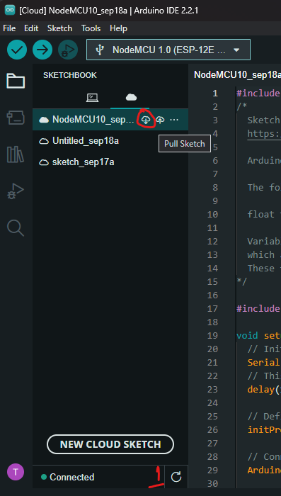
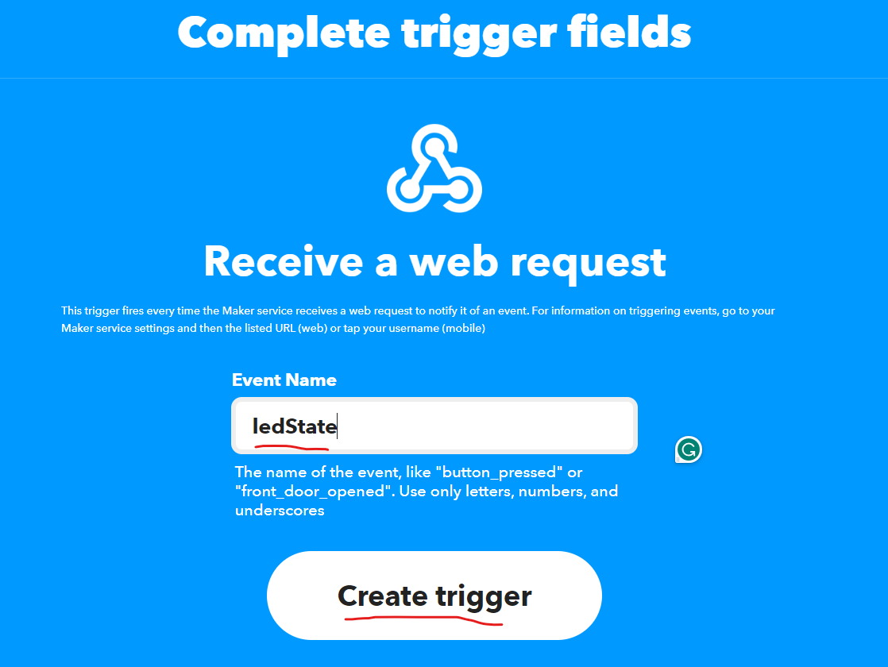
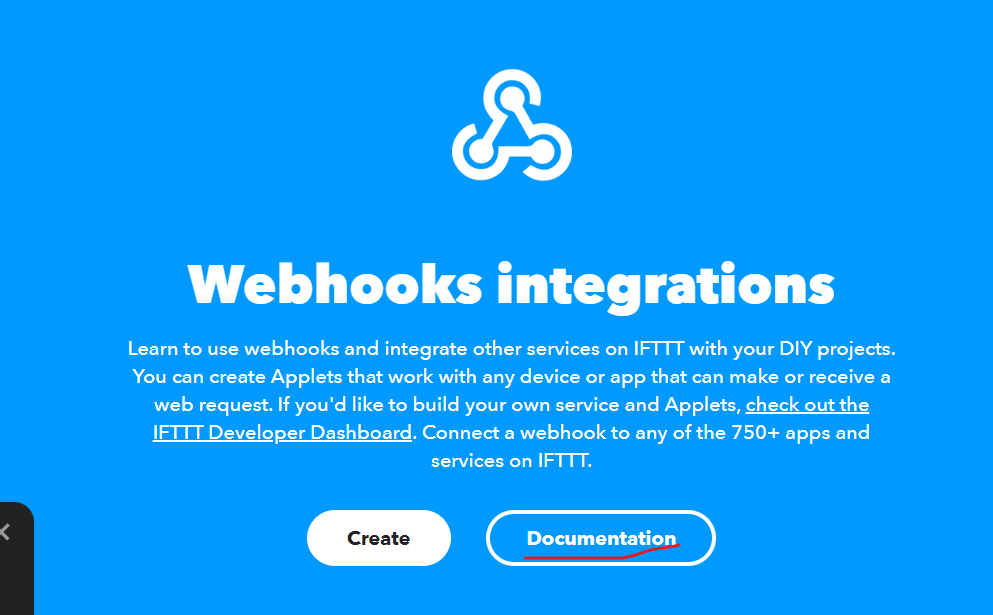

Cài đặt nhận thông báo trên Arduino Cloud
=========================================

Tổng quan về nội dung thực hiện
-------------------------------

Nội dung thực hiện sẽ trình bày cách cài đặt nhận thông báo về trạng thái led trên `module NodeMCU V3 CH340 <NodeMCUV3_>`_.

Môi trường làm việc
-------------------

Để cài đặt nhận thông báo trên Arduino Cloud, cần có môi trường làm việc như đã đề cập ở phần :ref:`tổng quan <phan-tong-quan>` và tài khoản trên nền tảng IFTTT_.

Ngoài ra, các bước thực hiện bên dưới, sẽ dựa trên hoạt động đã thực hiện ở phần :ref:`thực hiện hệ thống <phan-thuc-hien-he-thong>`.

Phần 2: Các bước thực hiện để cấu hình điều khiển led thông qua cloud
--------------------------------------------------------------------

1. Thiết lập bo mạch
````````````````````

Chuẩn bị các linh kiện như phần :ref:`thực hiện hệ thống <phan-thuc-hien-he-thong>`, **ngoại trừ cảm biến LM35**. Sau đó, chuẩn bị thêm **led đơn và điện trở 220 ohm**.

Tiếp theo, tiến hành nối các thành phần (minh họa như hình bên dưới) dựa trên breadboard.

1. Cắm NodeMCU ESP8266 lên breadboard.
2. Cắm Led đơn và điện trở.
3. Nối dây GND vào chân âm của led và một đầu của điện trở vào chân **D0** của module.


.. _IFTTT: https://ifttt.com/
.. _NodeMCUV3: https://nshopvn.com/product/arduino-nodemcu-lua-wifi-v3/

2. Cài đặt trên Arduino Cloud
`````````````````````````````

Đầu tiên, dựa trên thing đã tạo ở phần :ref:`thực hiện hệ thống <phan-thuc-hien-he-thong>`, tạo thêm một variable để cập nhật trạng thái led.

.. figure:: ./pics/Screenshot-ledstate-variable-create.png
    :align: center

3. Lập trình trên Arduino IDE
`````````````````````````````

Đầu tiên, tiến hành pull sketch để cập nhật thay đổi trên cloud.



Sau đó, dựa trên callback **onLedStateChange**, lập trình các đoạn code điều khiển led thông qua cloud.

.. code-block:: diff

    #include "arduino_secrets.h"
    /* 
    Sketch generated by the Arduino IoT Cloud Thing "Untitled"
    https://create.arduino.cc/cloud/things/f9b143ca-27f9-4bde-8e17-b2664c5f61dd 

    Arduino IoT Cloud Variables description

    The following variables are automatically generated and updated when changes are made to the Thing

    float temperature;
    bool ledState;

    Variables which are marked as READ/WRITE in the Cloud Thing will also have functions
    which are called when their values are changed from the Dashboard.
    These functions are generated with the Thing and added at the end of this sketch.
    */

    #include "thingProperties.h"
    int sensorPin = A0;
    + int ledPin = 16; // GPIO16 (D0)
    void setup() {
    // Initialize serial and wait for port to open:
    Serial.begin(9600);
    // This delay gives the chance to wait for a Serial Monitor without blocking if none is found
    delay(1500); 

    // Defined in thingProperties.h
    initProperties();

    // Connect to Arduino IoT Cloud
    ArduinoCloud.begin(ArduinoIoTPreferredConnection);
    
    /*
        The following function allows you to obtain more information
        related to the state of network and IoT Cloud connection and errors
        the higher number the more granular information you’ll get.
        The default is 0 (only errors).
        Maximum is 4
    */
    setDebugMessageLevel(2);
    ArduinoCloud.printDebugInfo();

    + pinMode(ledPin, OUTPUT);
    }

    void loop() {
    ArduinoCloud.update();
    // Your code here 
    int reading = analogRead(sensorPin);
    float voltage = reading * 3.3 / 1024.0;
    temperature = voltage * 100.0;

    Serial.println(temperature);
    delay(1000);
    
    }

    /*
    Since LedState is READ_WRITE variable, onLedStateChange() is
    executed every time a new value is received from IoT Cloud.
    */
    void onLedStateChange()  {
    // Add your code here to act upon LedState change
    + if(ledState)
    +     digitalWrite(ledPin, HIGH);
    + else
    +     digitalWrite(ledPin, LOW);
    + Serial.printf("\r\n Led State is %d", digitalRead(ledPin));
    }

Sau đó, trên phần Dashboards của Arduino Cloud, tạo một switch widget và link với ledState variable đã tạo.


Lúc này, việc thiết lập điều khiển trên cloud đã hoàn thành và có thể bật/tắt led thông qua widget trên Dashboard.

Phần 2: Các bước thực hiện để cấu hình gửi thôn báo
---------------------------------------------------

1. Cấu hình trên IFTTT
``````````````````````

Đầu tiên, đăng nhập vào nền tảng IFTTT và chọn **Create**.


Trong phần tiếp theo, trong phần **If This**, chọn **Add**.


Trong phần chọn service, chọn **Webhooks**.


Trong phần **Choose a trigger**, chọn **Receive a web request**. Sau đó, chọn **Connect**.


Trong phần **Complete trigger fields**, đặt **Event Name** và chọn **Create trigger**.



Tiếp theo, quay về màn hình cũ, trong phần **Then That**, chọn **Add**.


Tiếp theo, trong phần **Choose a service**, chọn **Gmail**.


Sau đó, trong phần **Choose an action**, chọn **Send yourself an email**. Sau đó, chọn **Connect**.


Cuối cùng, trong phần **Complete action fields**, chọn **Create action**.


Chọn **Continue** và **Finish** khi quay về màn hình cũ.

Trong màn hình tiếp theo, chọn icon **Webhooks Receive a web request**.

.. figure:: ./pics/Screenshot-ifttt-webhooks-receive-a-request.png
    :align: center

Trong phần **Webhooks integrations**, chọn **Documentation**.



Cuối cùng, trong phần **To trigger an Event with 3 JSON values**, nhập event name, bấm thử **Test it**, và copy phần URL được tạo ra.


2. Cấu hình trên Arduino Cloud
``````````````````````````````

Trên Arduino Cloud, chọn vào 1 thing, sau đó chọn Set webhook.


Sau đó, trong cửa sổ **Set webhook**, nhập URL đã tạo ra từ IFTTT và chọn **Set webhook**.


Cuối cùng, quan sát các thông báo từ email thông qua nền tảng IFTTT.

